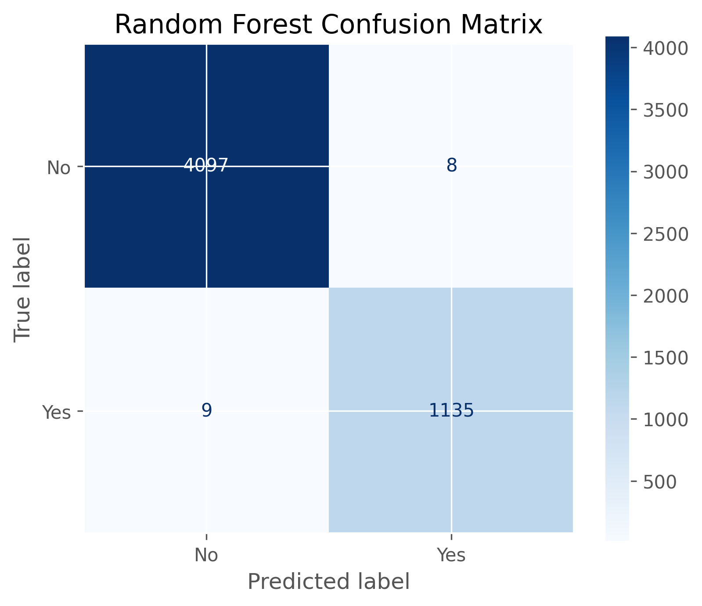
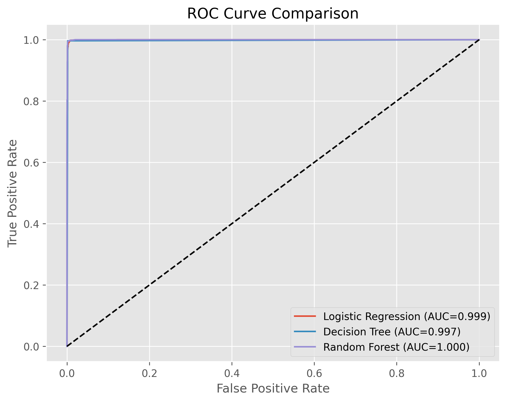
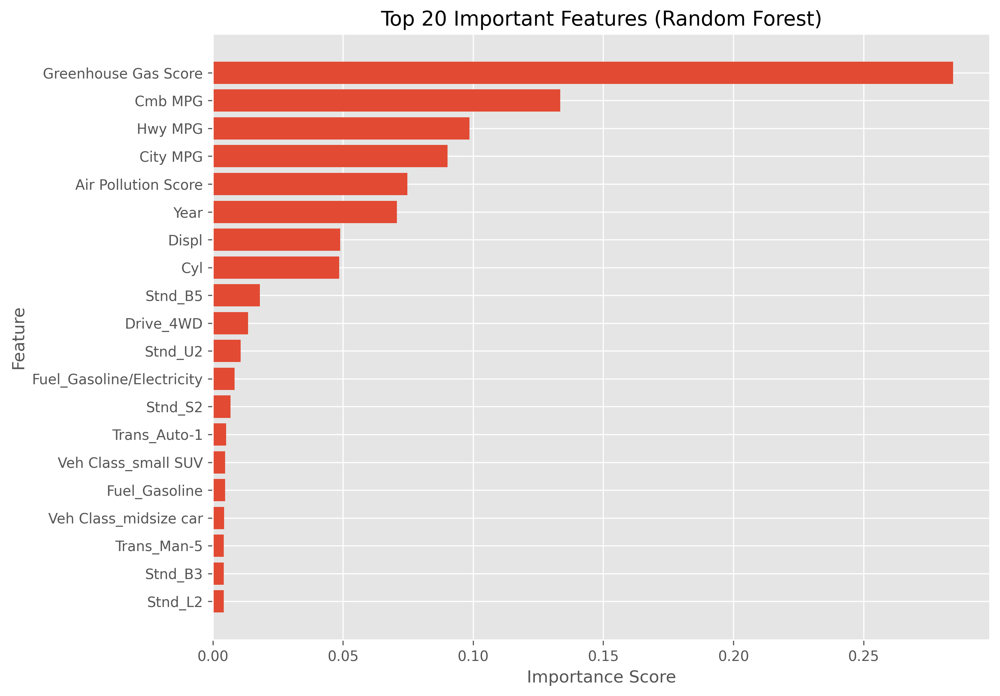

# 🚗 SmartWay Vehicle Classification using Machine Learning


## 📌 Project Overview

This project analyzes the **EPA Fuel Economy Dataset (2008–2018)** and builds a Machine Learning model to classify whether a vehicle is **SmartWay Certified**.

The project covers the complete Machine Learning pipeline including:

- Exploratory Data Analysis (EDA)
- Data Cleaning & Preprocessing
- Feature Engineering
- Feature Encoding
- Model Training
- Model Evaluation
- Feature Importance Analysis
- Model Saving

---

# 🎯 Objectives

The project answers the following questions:

- Has fuel economy improved over the years?
- What characteristics are associated with better fuel economy?
- Can a vehicle be classified as SmartWay certified using Machine Learning?

---

# 📊 Dataset Information

**Source:** EPA Fuel Economy Dataset

Years Covered:

- 2008
- 2009
- 2010
- 2011
- 2012
- 2013
- 2014
- 2015
- 2016
- 2017
- 2018

Final Dataset

- **Rows:** 26,241
- **Columns:** 16

---

# 🛠 Technologies Used

- Python
- Pandas
- NumPy
- Matplotlib
- Seaborn
- Scikit-Learn
- Joblib
- Google Colab

---

# 📈 Exploratory Data Analysis

The following analyses were performed:

- Fuel Economy Trend (2008–2018)
- SmartWay Vehicle Analysis
- Vehicle Class vs MPG
- Fuel Type vs Fuel Economy
- Engine Size vs MPG
- Cylinder Count vs MPG
- Drive Type vs Fuel Economy
- Correlation Analysis

---

# 🧹 Data Preprocessing

The preprocessing pipeline includes:

- Finding common columns across all datasets
- Standardizing categorical values
- Converting numeric columns
- Handling missing values
- Removing duplicates
- Merging all yearly datasets
- Dataset quality verification

---

# ⚙ Feature Engineering

The following feature engineering steps were performed:

- SmartWay label standardization
- Binary target creation
- Feature selection
- One-Hot Encoding
- Feature scaling using StandardScaler

Removed identifier columns:

- Model
- Underhood ID

---

# 🤖 Machine Learning Models

Three classification models were trained.

| Model | Accuracy | Precision | Recall | F1 Score |
|--------|----------|-----------|---------|----------|
| Logistic Regression | **99.47%** | 98.44% | 99.13% | 98.78% |
| Decision Tree | **99.79%** | 99.39% | 99.65% | 99.52% |
| Random Forest | **99.68%** | 99.30% | 99.21% | 99.26% |

---

# 📉 ROC-AUC Scores

| Model | ROC-AUC |
|---------|----------|
| Logistic Regression | **0.9994** |
| Decision Tree | **0.9974** |
| Random Forest | **0.9998** |

---

# ⭐ Best Model

Although all models performed exceptionally well, **Random Forest** was selected as the final model because of its strong overall performance and robustness.

Saved Model:

- `smartway_random_forest_model.pkl`

Saved Scaler:

- `feature_scaler.pkl`

---

# 📊 Top Important Features

The Random Forest model identified the following features as the most influential:

- Greenhouse Gas Score
- Combined MPG
- Highway MPG
- City MPG
- Air Pollution Score
- Year
- Engine Displacement
- Cylinders

---
## 📊 Model Performance

### Confusion Matrix



---

### ROC Curve



---

### Feature Importance



# 📂 Project Structure

```
SmartWay-Vehicle-Classification/

│

├── data/
│ ├── smartway_cleaned_dataset.csv
│ └── smartway_ml_dataset.csv

├── models/
│ ├── smartway_random_forest_model.pkl
│ └── feature_scaler.pkl

├── notebook/
│ └── FuelEconomyProject.ipynb

├── outputs/
│ ├── confusion_matrix.png
│ ├── roc_curve.png
│ ├── feature_importance.png
│ └── model_comparison.csv

├── requirements.txt

└── README.md
```

---

# 🚀 How to Run

Clone the repository

```bash
git clone https://github.com/Princeg1204/SmartWay-Vehicle-Classification.git
```

Install dependencies

```bash
pip install -r requirements.txt
```

Open the notebook

```
FuelEconomyProject.ipynb
```

Run all cells.

---

# 📁 Outputs

The project generates:

- Cleaned Dataset
- Machine Learning Dataset
- Model Comparison CSV
- Confusion Matrix
- ROC Curve
- Feature Importance Plot
- Trained Random Forest Model
- Feature Scaler

---

# 📌 Future Improvements

Possible future enhancements include:

- Hyperparameter Tuning
- XGBoost
- LightGBM
- Deep Learning Models
- Streamlit Deployment
- Flask/FastAPI Deployment
- SHAP Explainability

---

# 👨‍💻 Author

**Prince Gajera**

GitHub:
https://github.com/Princeg1204

---

## ⭐ If you found this project useful, consider giving it a Star!
