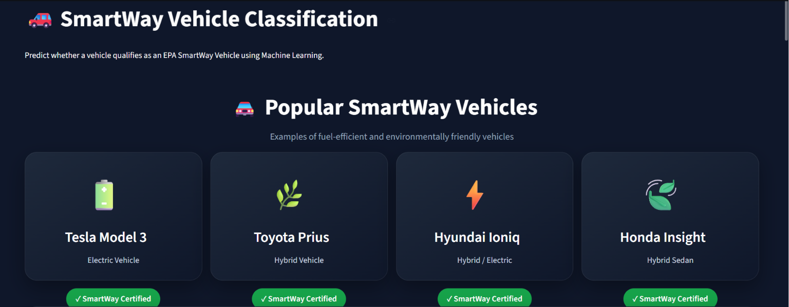
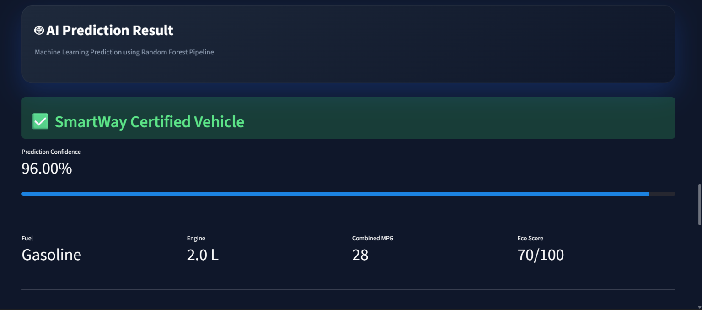
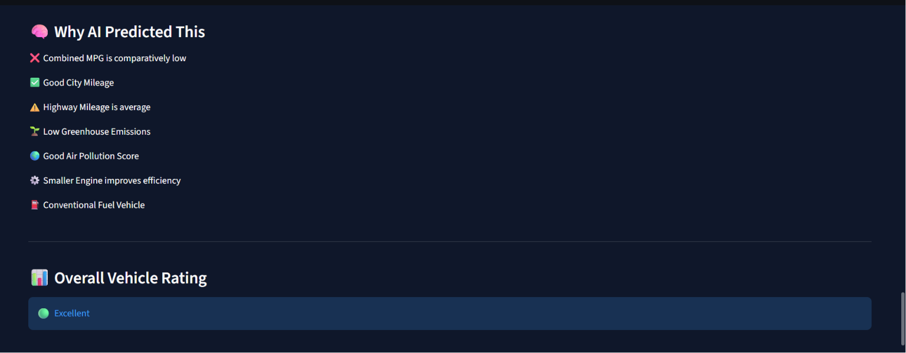

# 🚗 SmartWay Vehicle Classification using Machine Learning

## 🌐 Live Demo

https://smartway-vehicle-classification-6mkyupxzexwkfucf34bcbq.streamlit.app

---

> An end-to-end Machine Learning web application that predicts whether a vehicle qualifies as an **EPA SmartWay Certified Vehicle** using environmental and vehicle specifications.


---

# 📌 Project Overview

This project is an **End-to-End Machine Learning Application** developed using **Python, Scikit-learn, and Streamlit**.

The application predicts whether a vehicle is **EPA SmartWay Certified** based on important environmental and vehicle-related features.

The project covers the complete Machine Learning workflow:

- Data Collection
- Exploratory Data Analysis (EDA)
- Data Cleaning
- Feature Engineering
- Feature Encoding
- Model Training
- Model Evaluation
- Model Deployment
- Interactive Streamlit Web Application

---

# ✨ Features

✅ Premium Streamlit User Interface

✅ Real-Time Vehicle Prediction

✅ Machine Learning Pipeline

✅ Prediction Confidence Score

✅ AI-Based Prediction Explanation

✅ Eco Score Calculation

✅ Vehicle Summary Dashboard

✅ Download Prediction Report (CSV)

---

## 📷 Application Preview

### Home Page

> 

---

### Prediction Result

> 

---

### AI Explanation Dashboard

> 

---
## 📊 Model Performance

### Confusion Matrix


---

### ROC Curve


---

### Feature Importance


# 📊 Dataset Information

**Dataset Source**

EPA Fuel Economy Dataset (2008–2018)

Dataset Size

- **Rows:** 26,241
- **Columns:** 16

Target Variable

- SmartWay Certification

---

# 🛠 Tech Stack

### Programming Language

- Python

### Libraries

- Pandas
- NumPy
- Scikit-learn
- Joblib
- Streamlit
- Matplotlib

### Machine Learning

- Logistic Regression
- Decision Tree
- Random Forest

---

# ⚙ Machine Learning Pipeline

The project follows an end-to-end deployment pipeline.

```
Input Features
       │
       ▼
Data Preprocessing
       │
       ▼
Feature Encoding
       │
       ▼
Standardization
       │
       ▼
Random Forest Model
       │
       ▼
Prediction
       │
       ▼
SmartWay Classification
```

---

# 🚘 Input Features

The prediction model uses the following features:

- Air Pollution Score
- City MPG
- Combined MPG
- Cylinders
- Engine Displacement
- Drive Type
- Fuel Type
- Greenhouse Gas Score
- Highway MPG
- Emission Standard
- Transmission
- Vehicle Class
- Model Year

---

# 🤖 Machine Learning Models

| Model | Accuracy |
|---------|----------|
| Logistic Regression | 99.47% |
| Decision Tree | 99.79% |
| Random Forest | 99.68% |

### Final Selected Model

✅ Random Forest Classifier

---

# 📈 Model Performance

The project includes:

- Confusion Matrix
- ROC Curve
- Feature Importance Analysis
- Model Comparison

---

# 📂 Project Structure

```text
SmartWay-Vehicle-Classification/

│
├── app.py
├── requirements.txt
├── README.md
├── .gitignore
│
├── data/
│   ├── smartway_cleaned_dataset.csv
│   └── smartway_ml_dataset.csv
│
├── models/
│   ├── smartway_pipeline.pkl
│   ├── smartway_random_forest_model.pkl
│   └── feature_scaler.pkl
│
├── notebook/
│   └── FuelEconomyProject.ipynb
│
├── outputs/
│   ├── confusion_matrix.png
│   ├── feature_importance.png
│   ├── roc_curve.png
│   └── model_comparison.csv
```

---

# 🚀 Installation

Clone the repository

```bash
git clone https://github.com/Princeg1204/SmartWay-Vehicle-Classification.git
```

Go to project directory

```bash
cd SmartWay-Vehicle-Classification
```

Install dependencies

```bash
pip install -r requirements.txt
```

Run the Streamlit application

```bash
streamlit run app.py
```

---

# 📁 Outputs

The application provides

- SmartWay Prediction
- Prediction Confidence
- AI Explanation
- Eco Score
- Vehicle Summary
- Downloadable CSV Report

---

# 🔮 Future Improvements

- SHAP Explainability
- Docker Deployment
- AWS Deployment
- XGBoost Implementation
- LightGBM Model
- Model Monitoring Dashboard

---

# 👨‍💻 Author

**Prince Gajera**

AI & Machine Learning Enthusiast

GitHub:

https://github.com/Princeg1204

LinkedIn:

https://www.linkedin.com/in/princegajera/

Portfolio:

https://6a2e92fe1463d6dacab32517--my-portfolio-0412.netlify.app/

---

## ⭐ If you found this project useful, don't forget to Star the repository.
